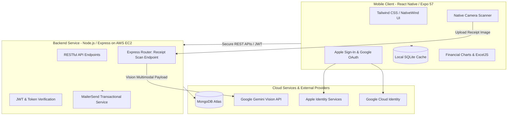
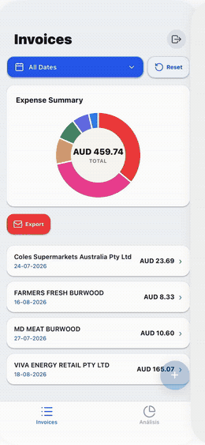

# Invoice System Management (ISM) 📊📱

A full-stack, cross-platform mobile business management and invoicing platform built with React Native (Expo) and a Node.js / Express backend deployed on AWS EC2.

ISM automates end-to-end invoice lifecycles, offering multi-provider federated authentication, multimodal OCR receipt parsing via Gemini AI, automated email distribution via MailerSend, offline-first local persistence via SQLite, and financial data reporting.

> 🚧 **Status:** Actively developed personal project — currently in Internal Testing on Google Play Console and TestFlight on Apple App Store Connect.

---

## 🏗 System Architecture

---

## 🚀 Key Features

* **Cross-Platform Mobile App:** Responsive UI built with Tailwind CSS (NativeWind) and React Navigation.
* **Multimodal AI OCR:** Extracts structured text from camera-scanned receipts using the Gemini API.
* **Multi-Provider Authentication:** Native Apple Sign-In (`expo-apple-authentication`) and Google Sign-In with encrypted token storage (`expo-secure-store`).
* **Local Persistence & Performance:** Offline-first caching and fast structured local queries powered by `expo-sqlite`.
* **Cloud & DevOps:** Node.js API deployed on AWS EC2; mobile distribution tested on Google Play Console (Internal Testing) & Apple App Store Connect / TestFlight.
* **Automated Quality Testing:** Unit & component test coverage with Jest, Jest-Expo, and React Native Testing Library on the client, and Jest + Supertest on the server.
* **Document & Data Export:** Native camera scanning and automated `.xlsx` export using ExcelJS, plus scheduled report delivery by email.

---

## 📸 Screenshots

*Receipt scan → AI-powered OCR extraction → invoice detail view.*

---

## 📁 Repository Structure

* [`/invoiceSystemManagement`](./invoiceSystemManagement) — React Native mobile application frontend (Expo). [See client README](./invoiceSystemManagement/README.md).
* [`/server`](./server) — Node.js, Express, MongoDB API, and AWS deployment configuration. [See server README](./server/README.md).

---

## 🛠 Tech Stack Overview

| Category | Technologies |
| :--- | :--- |
| **Mobile Client** | React Native, Expo 57, React 19, NativeWind (Tailwind CSS), Reanimated |
| **Local Storage** | SQLite (`expo-sqlite`) |
| **Backend & Cloud** | Node.js, Express.js, MongoDB, AWS EC2, Google Cloud Console |
| **Auth & Security** | Apple Sign-In (`expo-apple-authentication`), Google Sign-In, `expo-secure-store`, JWT |
| **APIs & AI** | Google Gemini API (Multimodal OCR), MailerSend API |
| **Testing** | Jest, Jest-Expo, React Native Testing Library, Supertest, `jest-html-reporter` |
| **Distribution** | Google Play Console (Internal Tracks), App Store Connect (TestFlight) |

---

## 🚀 Getting Started

Each part of the project has its own setup instructions:

* **Mobile client:** see [`/invoiceSystemManagement/README.md`](./invoiceSystemManagement/README.md#-local-development-setup)
* **Backend server:** see [`/server/README.md`](./server/README.md#-local-development-setup)