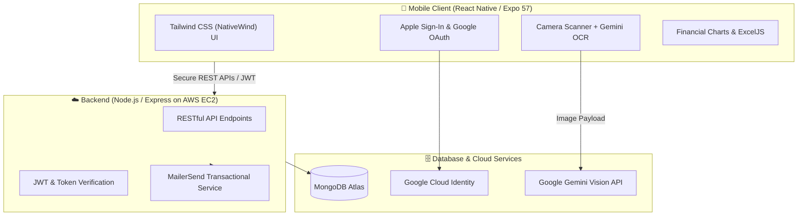

# Invoice System Management (ISM) 📊📱

A full-stack, cross-platform mobile business management and invoicing platform built with React Native (Expo) and a scalable Node.js / Express backend hosted on AWS EC2.

ISM automates end-to-end invoice lifecycles, offering multi-provider federated authentication, multimodal OCR receipt parsing via Gemini AI, automated email distribution via MailerSend, and financial data reporting.

---

## 🏗 System Architecture

---

## 🚀 Key Features

* **Cross-Platform Mobile App:** Responsive UI built with Tailwind CSS (NativeWind) and React Navigation.
* **Multimodal AI OCR:** Extracts structured text from camera-scanned receipts using the Gemini API.
* **Multi-Provider Authentication:** Native Apple Sign-In and Google Sign-In with encrypted token storage (`expo-secure-store`).
* **Cloud & DevOps:** Node.js API running on AWS EC2; mobile distribution tested on Google Play Console (Internal Testing) & Apple TestFlight.
* **Automated Quality Testing:** Full unit & component test coverage with Jest, Jest-Expo, and React Native Testing Library.
* **Document & Data Export:** Native camera scanning and automated `.xlsx` export using ExcelJS.

---

## 📁 Repository Structure

* [`/InvoiceSystemManagement`](./invoiceSystemManagement) — React Native mobile application frontend (Expo).
* [`/server`](./server) — Node.js, Express, MongoDB API, and AWS deployment configurations.

---

## 🛠 Tech Stack Overview

| Category | Technologies |
| :--- | :--- |
| **Mobile Client** | React Native, Expo 57, React 19, NativeWind (Tailwind CSS), Reanimated |
| **Backend & Cloud** | Node.js, Express.js, MongoDB, AWS EC2, Google Cloud Console |
| **Auth & Security** | Apple Authentication, Google Sign-In, `expo-secure-store`, JWT |
| **APIs & AI** | Google Gemini API (Multimodal OCR), MailerSend API |
| **Testing** | Jest, Jest-Expo, React Native Testing Library, `jest-html-reporter` |
| **Distribution** | Google Play Console (Internal Tracks), App Store Connect (TestFlight) |